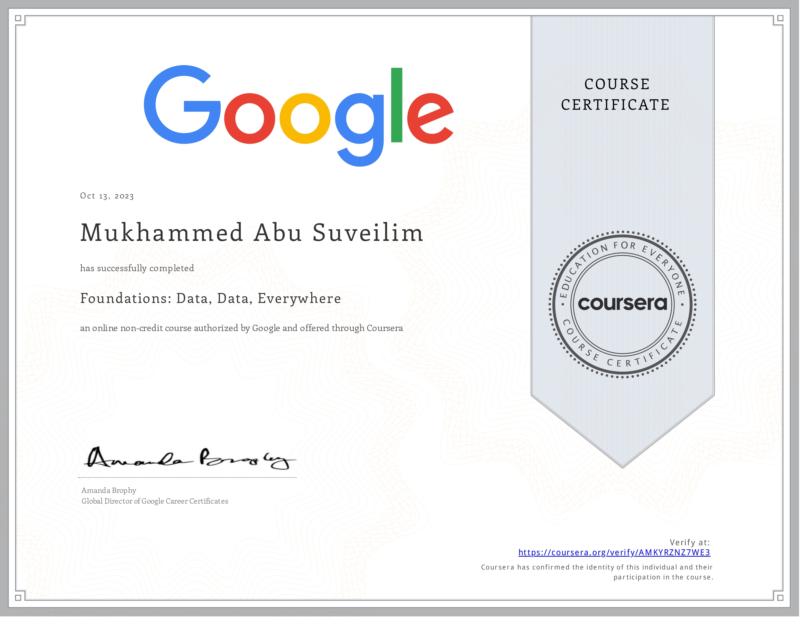
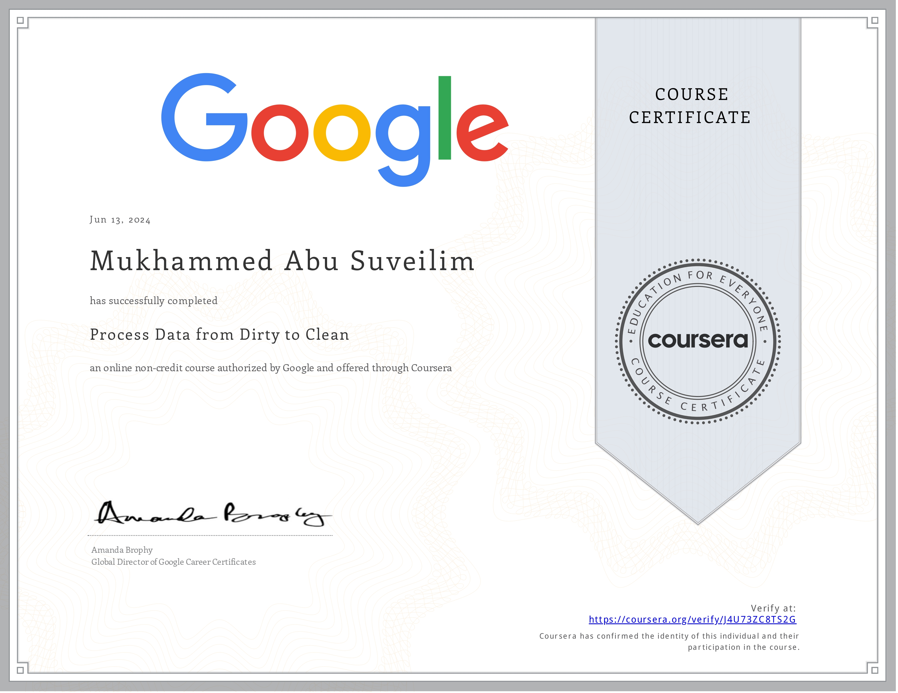
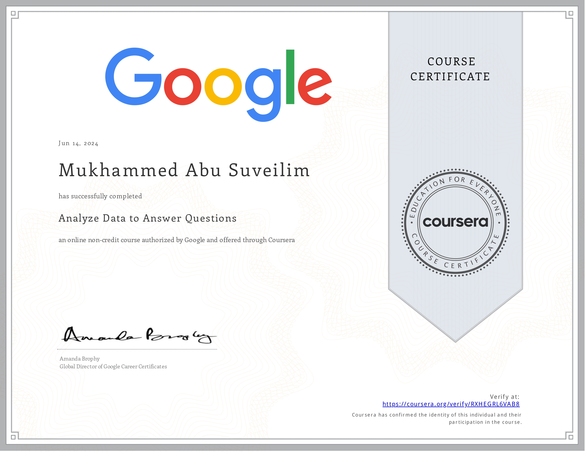

# Data Scientist

## Обо мне

Меня зовут Мухаммед. Я студент 4-го курса РУДН, учусь на программиста и математика. С детства люблю компьютеры, мне всегда было интересно разбирать и собирать их обратно. Я всегда знал, что буду программистом либо инженером/ученым. Когда я стал подростком, уже меньше думал о программировании, но я начал изучать английский язык, у меня была мечта – побывать в Америке. В 2015 году я поставил перед собой цель – учиться в Америке по программе обмена. В то время мы с семьей жили на Ближнем Востоке. Я узнал, что у нас есть программа обмена учеников для региона Ближнего Востока и Южной Европы YES (расшифровывается как Youth, Study & Exchange), которая позволяла учиться 1 год в США. Много лет я отлично учился в школе и дополнительно изучал английский язык, чтобы быть «YES student». В 2018 году я прошел многочисленные испытания и уехал учиться в американскую школу в Миннесоте. Я жил в американской семье в течение года, и там я очень подружился с Робертом (обычно его звали Боб) – отцом семьи. Боб работал главным инженером в компании по производству микрочипов «Микрон» (Micron). Думаю, что именно в тот момент, когда Боб показал мне одну из интегральных схем, над которой он работал, мои глаза загорелись огнем. Тогда я точно понял, что моя профессия должна быть связана с программированием. На данный момент я изучал Python, Julia, C++ и Java. Это то, что я изучал, но лучше всего знаю Python. У меня пять сертификатов курсов по Дата Сайенс от Google, поэтому работа с данными (анализ данных) меня интересует, а также разработка систем машинного обучения. В настоящее время я изучаю материалы по машинному обучению (в основном касающиеся анализа тональности и моделей BERT). В июне 2024 года сдал на отлично программу, которая сможет идентифицировать (sentiment target, sentiment) в новостях на английском языке (позже на русском). У меня много проектов по направлению ML. На Kaggle [ссылка на аккаунт Kaggle](https://www.kaggle.com/mukhammedabusuveilim) можете посмотреть, в каких соревнованиях я участвовал и какие наборы данных я собрал. На GitHub можете проверить мой код, проекты и всего подобного. Я готов попробовать что-то новое и интересное – я студент, поэтому готов искать новые возможности до тех пор, пока не найду то, что меня действительно интересует. Мне не важно, где работать – в офисе или удаленно. Хочу опробовать себя и принести пользу моей будущей компании.

## Образование 			        		
- Российский университет дружбы народов (июнь 2025)
	- Бакалавриат, четвертый курс, математика и компьютерные науки (02.03.01)

## Хард и софт скиллс
**Языки программирования**
- Python, SQL, Julia, C++.

**Технологии**
- Pandas, NumPy, TensorFlow, PyTorch, Matplotlib, Seaborn, Markdown.

**Инструменты**
- Git, Jupyter, MS Studio.

**Языки**
- Английский (C2), Арабский (родной).

**Сертификаты**
- Google Data Analytics Courses (Foundations: Data, Data, Everywhere; Ask
Questions to Make Data-Driven Decisions),

	- Первый сертификат: Foundations: Data, Data, Everywhere
	
	

	- Второй сертификат: Ask Questions to Make Data-Driven Decisions
	
	

	- Третий сертификат: Prepare Data for Exploration
	
	

	- Четвертый сертификат: Process Data from Dirty to Clean
	
	

	- Пятый сертификат: Analyze Data to Answer Questions

	

- TOELF IBT (C2) и другие экзамены по английскому
языку (PAST, AST, SAT, …).

**Софт скилс**
- опыт командной работы в проектах, подготовке презентаций, умение донести
свою идею.

## Публикации

- **Abu Suveilim, M. M.** (2025, to be published in April). Multilingual Sentiment Analysis in Financial
News. In the Proceedings of the **International Conference on Information and Telecommunication Technologies and Mathematical Modeling of High-Tech Systems (ITTMM) 2025**.

- **Абу Сувейлим, М. М.** (2024). Феномен проникновения сетевого сленга в научную речь. В:
**Информационно-коммуникативная культура специалиста в цифровую эпоху: материалы Международной студенческой проектной сессии**
15–17 мая 2024 г., Москва, Институт русского языка, РУДН.
Москва: РУДН, 2024. 271 с. : ил.
(Научный руководитель: Кривченкова И. В.)

## Проекты

### Анализ тональности новостей | Python, NumPy, Pandas, TensorFlow июнь 2024

- Данный проект находится в стадии разработки и является моей курсовой работой
третьего курса.
- Идея проекта заключается в определении пятерки/ 5-кортежа (sentiment-holder,
sentiment-target, sentiment-target-aspect, sentiment, sentiment-time) в новостях на
английском языке (в дальнейшем, и на русском языке).
- Модель на данный момент определяет объект сущности и тональность относительно к объекту (sentiment-target, sentiment).

- ссылка на репо проект [Анализ тональности новостей](https://github.com/Mukhammed-Abu-Suveilim/course_thesis/blob/master/PDF_course_thesis)

### Regression with an Insurance Dataset | lightGBM, Seaborn, matplotlib, Oputna декабрь 2024

- Задача звучит таким образом: дан набор данных с различными признаками разного
типа. На основе этих признаков нужно предсказать стоимость страхования. Задача
немного похожа на задачу кредитного скоринга — вместо объема кредита модель
предсказывает стоимость страхования. Проект включает в себя следующие этапы:
подготовка данных, feature engineering (например, преобразование дат, создание
новых признаков) и использование модели LightGBM. Особое внимание уделено
обработке пропущенных значений, которые сохраняются из-за их корреляции с
целевой переменной.

- ссылка на репо проект [Regression with an Insurance Dataset](https://github.com/Mukhammed-Abu-Suveilim/kaggle/blob/main/Regression%20with%20an%20Insurance%20Dataset)

### Кросс-лингвальный анализ тональности финансовых новостей | mBERT, Transformer, PyTorch    февраль 2025
- Этот проект является моей дипломной работой. Требуется сделать сравнительный анализ множества кросс-лингвальных моделей. Далее выбрать трансформер-модель (distil multilingual BERT) дообучить (fine tune) её на masked language modelling (MLM), затем дообучить её на анализ тональности финансовых новостей. У базовой модели оценка perplexity 12.11, а у fine tuned модели 6.04 (50% улучшение). Также у fine tuned модели по всем метрикам (Accuracy, Precision, Recall и F1) улучшение на 4-6%.

- ссылка на репо проект [Multilingual sentiment analysis](https://github.com/Mukhammed-Abu-Suveilim/diploma_thesis)

## Контакты
- Телефон: +79004852795
- Электронная почта: mukhammedabusuveilim@gmail.com  
